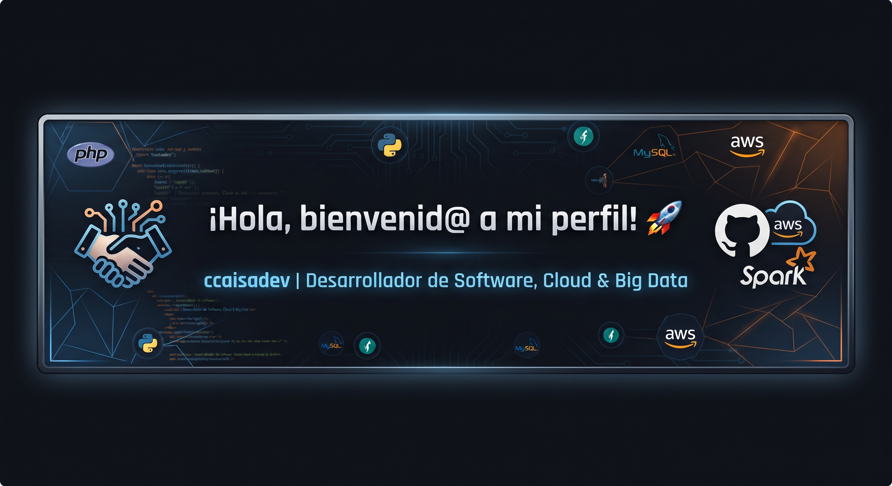

  

  
  

---

### 💻 Sobre mí
Soy un apasionado del desarrollo de software, la nube, la Inteligencia Artificial y el Big Data, especializándome en estas áreas para crear soluciones inteligentes, arquitecturas cloud eficientes y canalizaciones de datos avanzadas. Me encanta construir soluciones escalables, aprender continuamente y explorar nuevas tecnologías en el ecosistema tecnológico.

---

### 🛠️ Tecnologías y Stack Destacado

#### 🌐 Lenguajes y Backend

  
  
  
  

#### 🎨 Frontend & Estilos

  
  

#### ☁️ Cloud, Big Data, IA & Bases de Datos

  
  
  
  
  

#### ⚙️ Herramientas & Control de Versiones

  
  

---

### 🚀 Proyectos Destacados

  

<em>🛠️ Actualmente estoy desarrollando y puliendo nuevos proyectos orientados a desarrollo, IA y Big Data que publicaré muy pronto por aquí. ¡Mantente atento!</em>

---

### 📊 Estadísticas de GitHub

  
  

  

---

### 📬 Conectemos

  <a href="https://instagram.com/ccaisadev" target="_blank">
    

  

